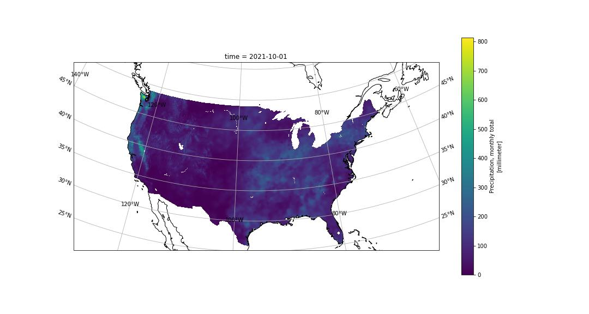

# NClimGrid (and perhaps NClimDiv)

## Summary

### Spatial Extent
- CONUS only

### Variables*
- Precipitation (prcp) (mm)
- Average Temperature (tavg) (Celsius)
- Minimum Temperature (tmin) (Celsius)
- Maximum Temperature (tmax) (Celsius)

### Data Products
- **Gridded:** NClimGrid and NClimGrid-d
    - Nominal 5 km grid (1/24th degree) interpolated from weather station locations
    - Monthly and Daily Grids
- **Divisional:** NClimDiv and NClimGrid-d
    - Derived from gridded data products via weighted averaging
    - 9 division types (e.g., state, county, census tract, ...)
    - Monthly and Daily text files
- Microsoft already hosts much of this
    - Monthly and Daily Grids
    - Daily Divisions
    - https://nclimgridwesteurope.blob.core.windows.net/nclimgrid

## Gridded

### [Monthly Grids](https://www.ncei.noaa.gov/data/nclimgrid-monthly/access/) (NClimGrid)
- Single NetCDF file for each variable
- Updated in place (monthly, I believe)
- January 1895 to present
- "On an annual basis, approximately one year of "final" nClimGrid will be submitted to replace the initially supplied "preliminary" data for the same time period."
    - https://www.ncei.noaa.gov/access/metadata/landing-page/bin/iso?id=gov.noaa.ncdc:C00332

**Example: October 2021 Precipitation**

### [Daily Grids](https://www1.ncdc.noaa.gov/pub/data/daily-grids/) (NClimGrid-d)
- Daily grids are contained in monthly NetCDF files for each variable
    - Prior to 1970, all four variables are in a single monthly NetCDF file
- Latest month is updated in place daily with a 3 day delay
- January 1, 1951 to present
- "...estimates for days in the current month will not be fully consistent with either the corresponding monthly products or the daily estimates for previous months and years until the fifth day of the following month."
    - https://www1.ncdc.noaa.gov/pub/data/daily-grids/docs/nclimdiv-description.pdf
    - Begs the question of whether the daily grids are also updated on the same annual basis as the monthly gridsread

## Divisional

### [Monthly Divisions](https://www.ncei.noaa.gov/pub/data/cirs/climdiv/) (NClimDiv)
- Single text files for each variable
- More variables than just prcp, tavg, tmin, and tmax
    - e.g., drought severity quantities

### [Daily Divisions](https://www1.ncdc.noaa.gov/pub/data/daily-grids/) (NClimDiv-d)
- Daily data for each variable (4) and each division (9) contained in monthly CSV files
    - 4 variables x 9 divisions = 36 CSV files

## Dicussion

### Questions
- The Gridded data seem similar to the Daymet data, which was converted to Zarr
    - Zarr?
    - Kerchunk?
    - COG?
- Is the Divisional data intended to for STAC indexing as well?
    - Currently not tied to spatial boundaries other than names (state, county, etc.)
    - Format?
- *Note that the data will be need to be updated as it continues to be released/updated on daily/monthly/annual intervals*
    - Dynamic ingest

### Minor Clarifications on Microsoft GitHub page describing the hosted data
- The line “…for the un-gridded source data. For un-gridded data:” indicates the ungridded data is source data. It is not - it is daily gridded data that has been averaged into divisions (counties, states, census tracts, etc.).
    - Just change the word “source” to “divisional”
- The sentence “Each file provides monthly values in a 5x5 lat/lon grid for the Continental United States.” suggests (to me, at least) that the grid is 5 degrees by 5 degrees. 
    - Actually a nominal 5 km by 5 km grid in lat/lon "coordinates". 
    - True spacing is 1/24th degree in lat/lon, which is an approximate 5 km grid (changes with latitude of course)

## Links
- NClimGrid
    - Home: https://www.ncei.noaa.gov/access/metadata/landing-page/bin/iso?id=gov.noaa.ncdc:C00332
    - Data (NetCDF): https://www.ncei.noaa.gov/data/nclimgrid-monthly/access/
- NClimGrid-d
    - Home: 
    - Data (NetCDF): https://www1.ncdc.noaa.gov/pub/data/daily-grids/
- NClimDiv
    - Home: https://www.ncei.noaa.gov/access/metadata/landing-page/bin/iso?id=gov.noaa.ncdc:C00005
    - Data (text): https://www.ncei.noaa.gov/pub/data/cirs/climdiv/
- NClimDiv-d
    - Home:
    - Data (CSV): https://www1.ncdc.noaa.gov/pub/data/daily-grids/

